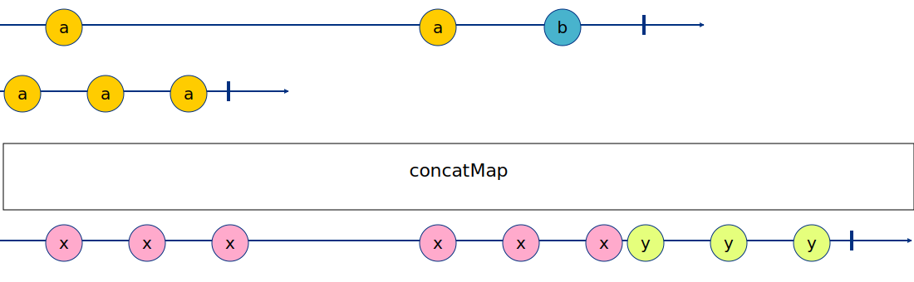
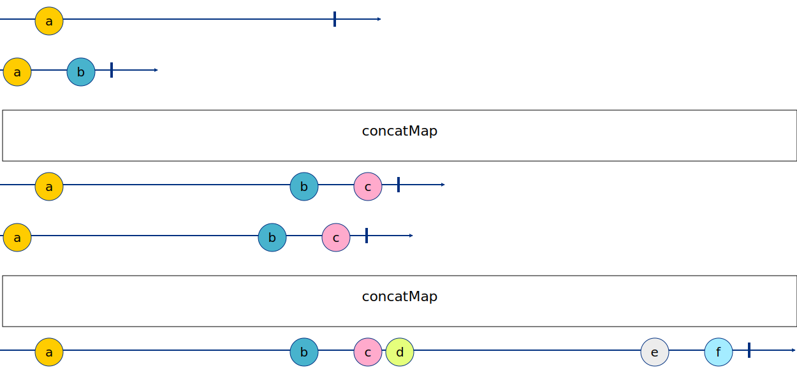
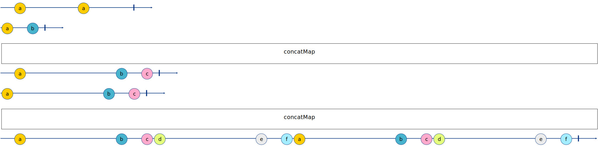

# CONCAT

**Concat Strategy** — Queuing up every new Observable, and subscribing to a new observable only when the last observable completed.

## Real life example for concatMap

Top Ten List
Let’s say you have a live observable that emits a list of the top ten movies of all times.

For each movie, we do the same thing as the mergeMap and issue another ajax request to IMDB to get his rank, but this time, the order of display matters.

So by using concatMap we can block the next movie from finding out its IMDB rank until our current movie found out its rank, that way, we keep the original order of movies.

## BMIU - one stage

```
-a--------a--b-|
a-a-a|
-x-x-x----x-x-xy-y-y| RESULT
```

IMG


## 6IRS - two stages - var 1.

```
-a--------|
a-b|
-a-------b-c| PARTIAL RESULT BETWEEN FIRST TWO OBSERVABLES
a-------b-c|
-a-------b-cd-------e-f| RESULT
```

IMG


## URST - two stages - var 2.

```
-a----a---|
a-b|
-a-------b-c| PARTIAL RESULT BETWEEN FIRST TWO OBSERVABLES
a-------b-c|
-a-------b-cd-------e-fa-------b-cd-------e-f| RESULT
```

IMG

