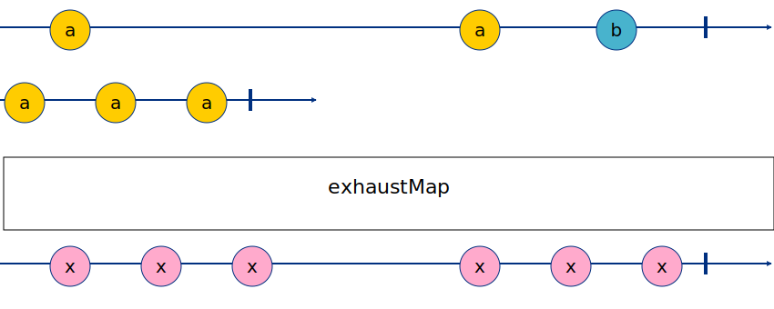
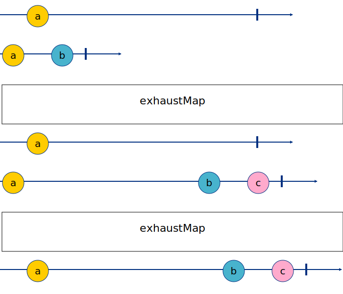
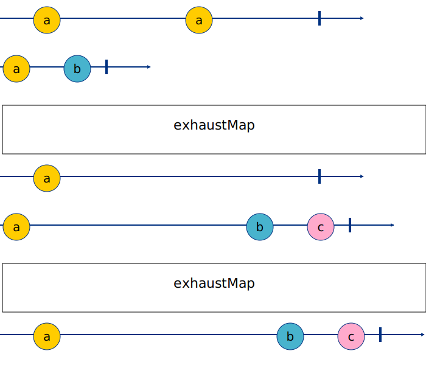

# EXHAUST

**Exhaust Strategy** — the “don’t interrupt me” strategy, ignores (and never subscribe to) any new mapped Observable while the current Observable is still emitting values.

## Real life example for exhaustMap

Login screen
Let’s say you have a login screen with a login button, where you map each click to an login ajax request.

If the user clicks more than once on the login button, it will cause multiple calls to the server, and you probably don’t want that…

So you can use exhaustMap to temporarily “disable” the mapping while the first http request is still on the go — this makes sure you never call the server while the current request is running.

## KIID - one stage

```
-a--------a--b-|
a-a-a|
-x-x-x----x-x-x| RESULT
```

IMG


## ASWW - two stages - var 1.

```
-a--------|
a-b|
a-------b-c|
-a-------b-c| RESULT
```

IMG


## NNOP - two stages - var 2.

```
-x----x---|
a-b|
a-------b-c|
-a-------b-c| RESULT
```

IMG

