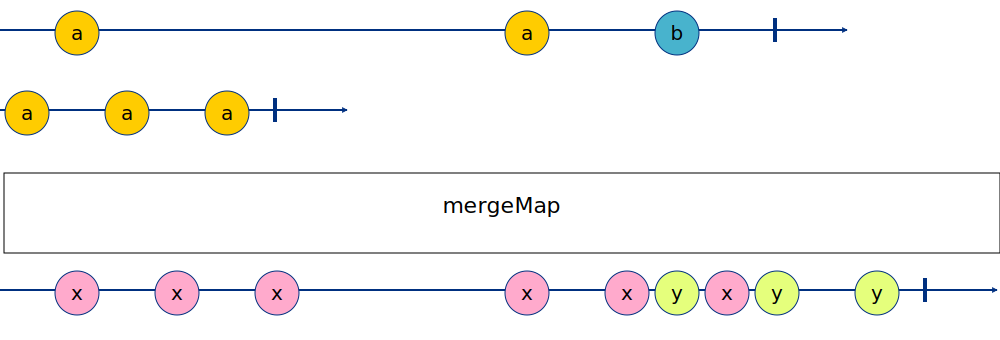
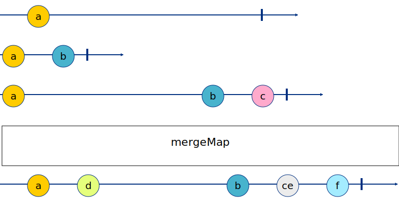
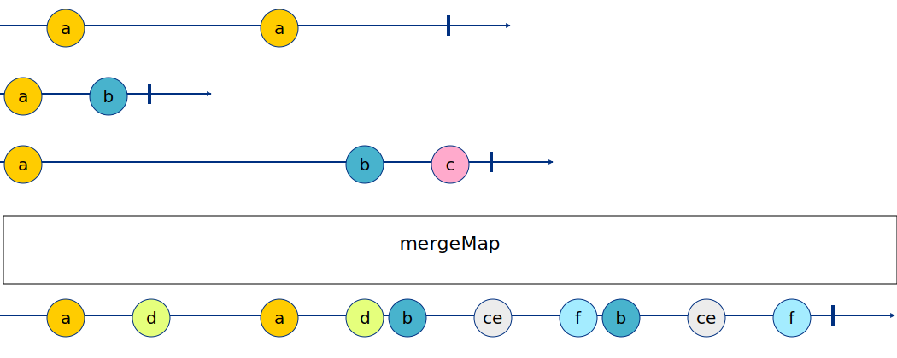

# MERGE

**Merge Strategy** — deciding not to do anything, basically, we just keep subscribing to every new observable that we return from the map.

## Real life example for mergeMap

Enhancing search results
Let’s say you show a live list of movies (via push notifications, like netflix).

For each movie, you might want to also call a 3rd party service, like IMDB to show it’s “up to date” movie rank.

So you can mergeMap the movie into an http request to IMDB and by that, to enhance your movie cards with this additional data.

## OVMD - one stage

```
-a--------a--b-|
a-a-a|
-x-x-x----x-xyxy-y| RESULT
```

IMG


## 23FE - two stages - var 1.

```
-a--------|
a-b|
a-------b-c|
-a-d-----b-(ce)-f| RESULT
```

????????????????????????????????????????????????????
TEST IS FAILING - I AM NOT ABLE TO CREATE RIGHT EXPECTED VALUE
????????????????????????????????????????????????????



## CSW0 - two stages - var 2.

```
-a----a---|
a-b|
a-------b-c|
-a-d--a-db-(ce)-fb-(ce)-f| RESULT
```

????????????????????????????????????????????????????
TEST IS FAILING - I AM NOT ABLE TO CREATE RIGHT EXPECTED VALUE
????????????????????????????????????????????????????

IMG

