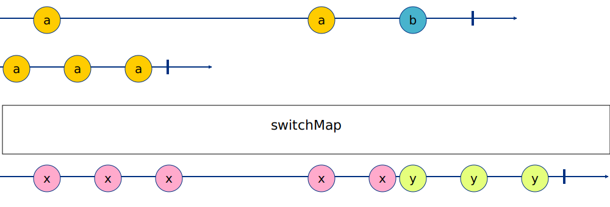
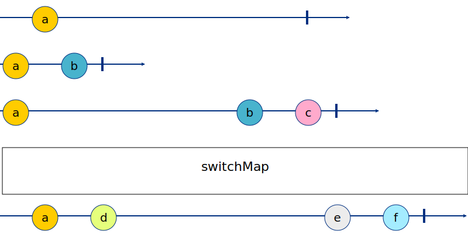
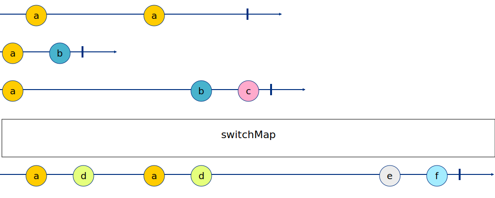

# SWITCH

**Switch Strategy** — unsubscribing from the last mapped observable, when the new one arrives.

## Real life example for switchMap

AutoComplete
If you google something, you press a key on the big input box, and then you get suggestions for things you might mean to write.

So every new input triggers a new ajax request for that search term.

If you just used mergeMap you’ll get suggestions for every key stroke
(“m”, “my “, “my p” …. “my parrot is looking at me like I owe him money!”)

But switchMap will make sure that the ongoing http request is being canceled on every new search input, and only the newest http request is live.

## KLRM - one stage

```
-a--------a--b-|
a-a-a|
-x-x-x----x-xy-y-y| RESULT
```



## 6IRS - two stages - var 1.

```
-a--------|
a-b|
a-------b-c|
-a-d-------e-f| RESULT
```



## URST - two stages - var 2.

```
-a----a---|
a-b|
a-------b-c|
-a-d--a-d-------e-f| RESULT
```


